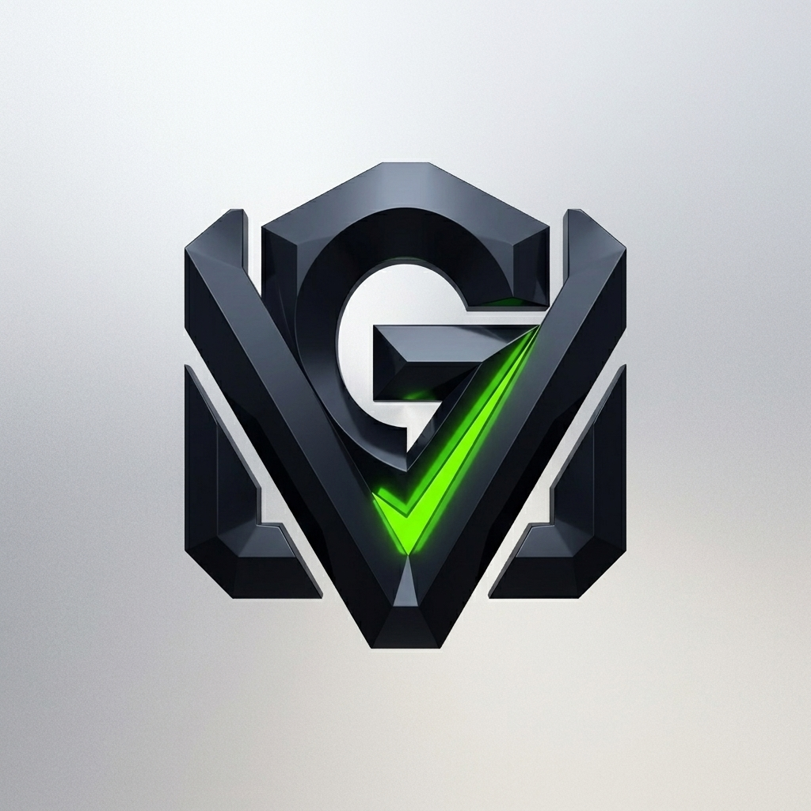
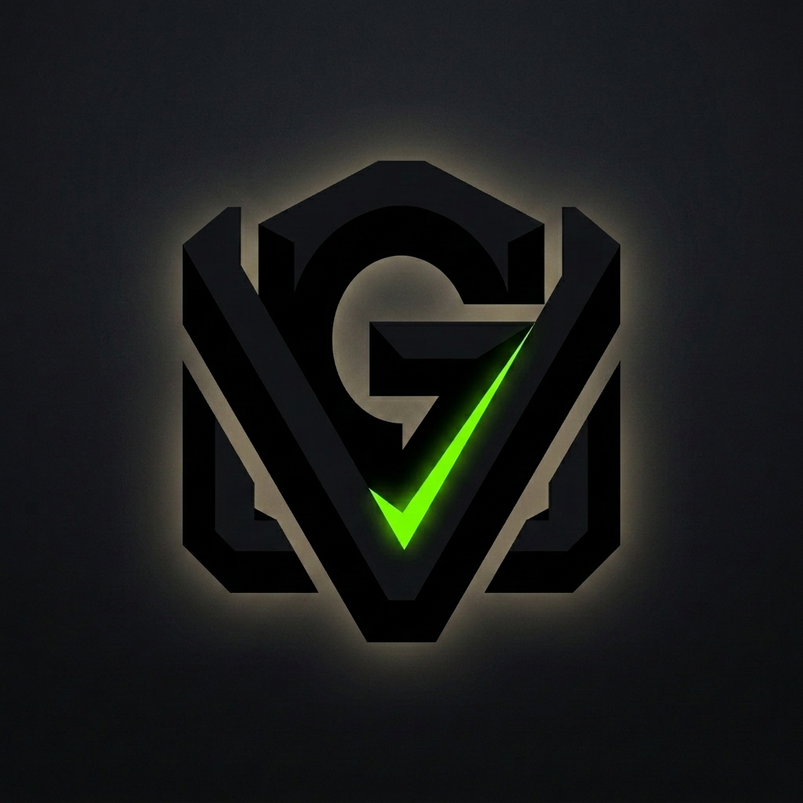
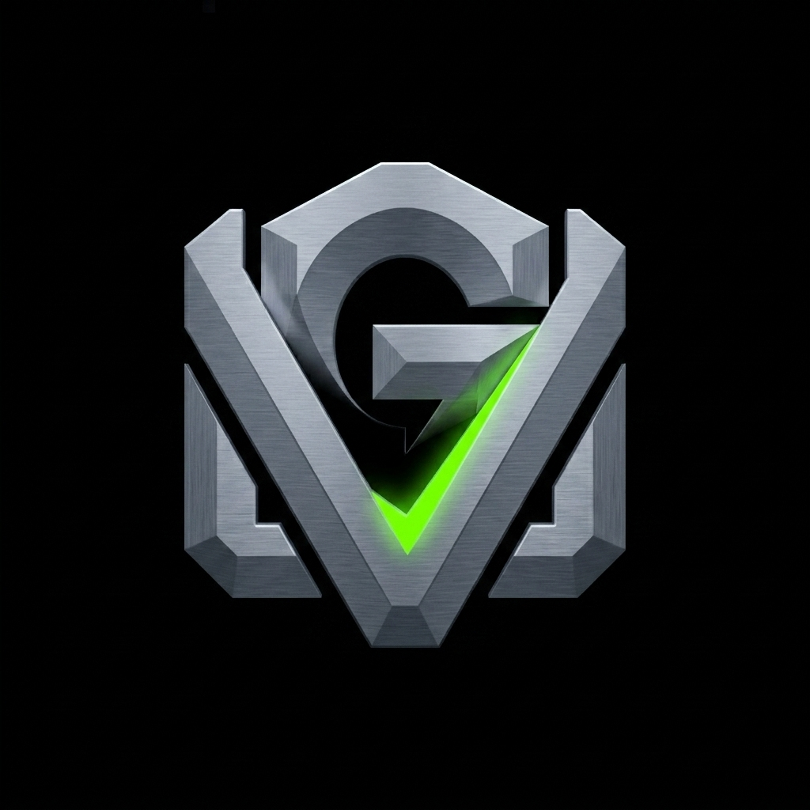

# The Monolith Signature

## Core Idea & Symbolism

A singular, bold, custom typographic ligature heavily abstracted into a purely geometric block. It acts as a foundational stone for the brand.

Our primary rendering uses a **High-Contrast Light Background**: It maintains the stark, dark obsidian logo but sets it against a premium, soft light-silver background. This provides maximum contrast and a very clean, sophisticated hardware feel. The neon green accent is perfectly sharp and contained, preventing any color bleed.

## Connection to Technology, Innovation, and Leadership

Conveys unwavering confidence, brutalist efficiency, and institutional weight. It signals that the brand is a permanent fixture in the tech landscape, not a fleeting trend.

## Expressing "GV"

The icon _is_ the "GV", but it's heavily abstracted into positive and negative space so that it reads first as a solid geometric block, and second as the initials.

## Strengths, Risks, and Differentiation

- **Strengths:** The ultimate "timeless" mark. Very high contrast and instantly recognizable silhouette. Commands immediate respect.
- **Risks:** Can feel stark, cold, or overly imposing without a carefully balanced color palette and supporting visual system.
- **Differentiation:** Rejects the soft, friendly aesthetic of consumer startups for a sharp, enterprise-grade authority.

## Applications

Demands respect in any application. Looks incredible debossed into premium materials, applied as a stark, high-contrast watermark, or standing alone on presentation covers.

---

## Alternative Renderings

While the light background is our primary mark, the following alternatives provide flexibility for different contexts (e.g., dark mode UI, moody brand graphics, or one-off designs).

### 1. Spotlight Glow Alternative

_Keeps both the background and the logo dark, but introduces a subtle, luminous radial spotlight behind the logo to make it pop and define the edges beautifully._

### 2. High-Contrast Dark Alternative

_Keeps the pitch-black background but lightens the monolith to a brushed metallic slate gray, maintaining the dark theme while increasing visibility._

