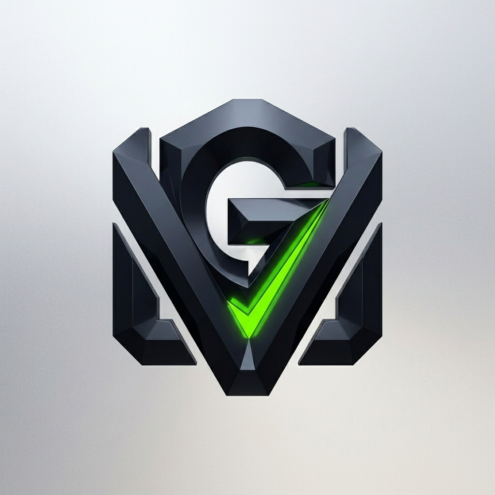
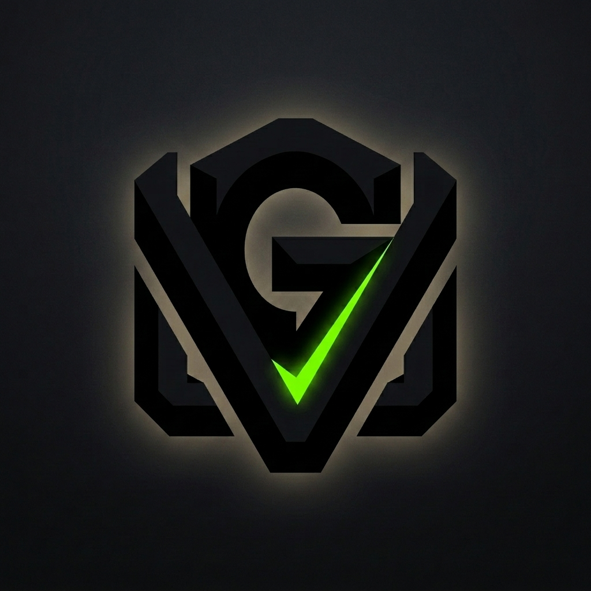
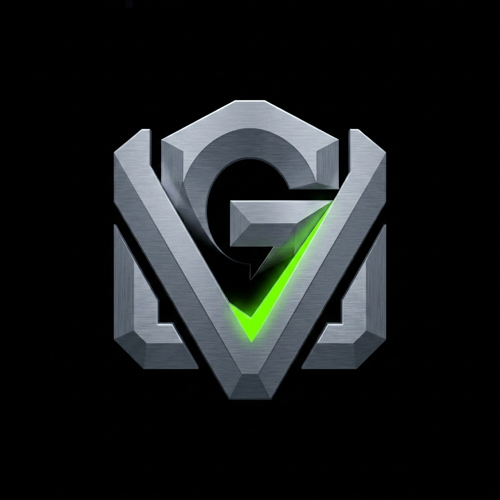

# Explanation: Brand — The Monolith Signature

## Core idea

A singular bold custom ligature abstracted into a geometric block — a foundational stone. Primary rendering: high-contrast light background (obsidian mark on soft light-silver, neon-green accent contained, no bleed).

## Technology / leadership signal

Unwavering confidence, brutalist efficiency, institutional weight — a permanent fixture, not a trend.

## The "GV"

The icon _is_ "GV", abstracted into positive/negative space: solid block first, initials second.

## Strengths / risks / differentiation

- Strengths: timeless, high-contrast silhouette, instantly recognizable.
- Risks: stark/cold without a balanced palette + supporting system.
- Differentiation: rejects soft consumer-startup friendly for enterprise-grade authority.

## Applications

Debossed materials, high-contrast watermarks, presentation covers.

## Alternatives

### Spotlight glow (dark contexts)

### High-contrast dark

Source: `docs/brand-identity/monolith-signature/identity.md` (kept as asset source).
